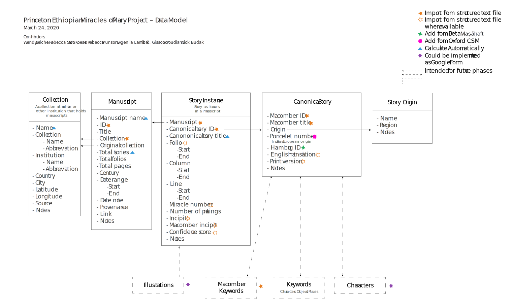

# PEMM data

This repository includes data from the [Princeton Ethiopian Miracles of Mary (PEMM)](https://cdh.princeton.edu/projects/ethiopian-miracles-mary-project/) that is automatically synchronized from Google Sheets.

| :warning:  | This site represents work in progress. Please consult the 2022 Zenodo upload for a presentation of the most useful, most complete data to date. Please contact Principal Investigator Wendy Laura Belcher at wbelcher@princeton.edu if you need more information; the data should not be cited without permission.       |
|---------------|:------------------------|

Files in the data directory should *NOT* be edited on GitHub.

## Data Model

This data model diagram shows how the documents in the data folder
are related to each other.

